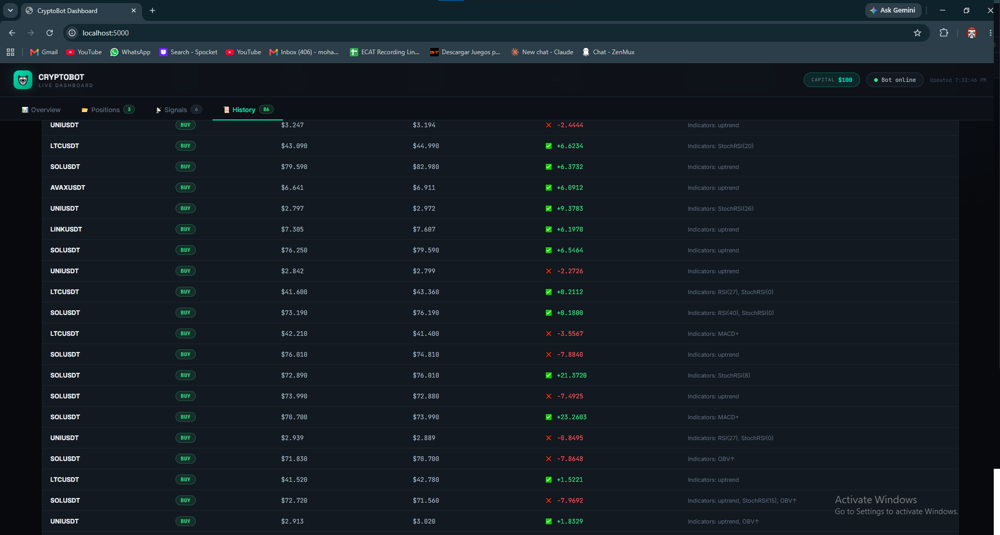

# 📸 Dashboard Preview

<table>
<tr>
<td width="50%" align="center">

### 📊 Main Dashboard



</td>

<td width="50%" align="center">

### 💹 Trade Dashboard


</td>
</tr>
</table>

# 🤖 AI Crypto Trading Bot — Stage 5

An AI-powered crypto trading bot that uses **Groq LLaMA 70B** to analyze markets, trades on **Binance Testnet** (paper money), and reports everything to **Discord**.

---

## Stage History

| Stage | Key improvement |
|---|---|
| 1 | Basic Claude/Groq analysis, simple signal count |
| 2 | Weighted scoring, volume gate, anti-chop, confluence rules, MACD slope, S/R zones |
| 3 | Cooling-off after losses, ATR-based SL/TP, rule engine with volume requirement |
| 4 | Candlestick patterns with double-weight, memory + performance feedback to AI |
| 5 | MACD bug fixed, Stoch RSI, OBV, daily loss guard, halt banner on dashboard |
| **6 (current)** | **Macro/inflation context (FRED CPI + Fed Funds rate) fed into every AI prompt** |

---


python
ai
trading
cryptocurrency
binance
discord-bot
machine-learning
llm
finance
automation
api
websocket
fastapi
dashboard
technical-analysis
## Stage 5 Changes (what changed and why)

### `trader.py`
- **MACD signal-line bug fixed** — the old code computed `ema(np.full(9, macd_val), 9)` which is always mathematically equal to `macd_val` itself. The signal line was always equal to MACD, the histogram was always 0, and no MACD signal could ever fire. Now computes a real EMA(12) and EMA(26) series, derives a MACD line history, and computes a proper EMA(9) signal line from that. Also exposes `macd_hist` and `macd_hist_prev` for slope detection.
- **Stochastic RSI** — catches momentum exhaustion earlier than regular RSI by normalising RSI within its own 14-bar range. Values below 20 = high-prob reversal zone (double weighted as bullish signal). Above 80 = same but bearish.
- **OBV (On-Balance Volume)** — tracks cumulative volume flow direction. Rising OBV confirms price moves. Divergence (OBV says one thing, price says another) flags as a caution signal.
- **Daily loss guard** — `check_daily_loss(budget_usdt)` resets at UTC midnight. If daily P&L drops below `MAX_DAILY_LOSS_PCT` (default 5%) of budget, all trading halts for the rest of the day.

### `analyst.py`
- MACD signal logic now uses `macd_hist` and `macd_hist_prev` (histogram slope) rather than broken crossover detection.
- Stochastic RSI and OBV signals added to `_compute_signals()`.
- System prompt updated with OBV divergence rule and Stoch RSI overbought/oversold gate.
- Prompt builder now shows Stoch RSI, MACD histogram, histogram slope, and OBV trend to the AI.

### `bot.py`
- Daily loss guard called at top of every trade cycle — halts early with Discord alert if triggered.
- Trade results (win/loss) are now fed back to the analyst after every SL/TP exit AND every SELL signal, so the cooling-off logic actually works.
- `bot_state.json` now includes `daily_pnl`, `trading_halted`, `halt_reason`.

### `dashboard.py`
- New **Today's P&L** stat card (resets at UTC midnight, green/red coloured).
- **Trading Halted** banner appears in red when daily loss limit is hit.

---

## Stage 6 Changes (what changed and why)

### `analyst.py`
- **New `_fetch_macro()` method** — pulls live US inflation (CPI, year-over-year %) and the current Fed Funds rate from the **FRED** (Federal Reserve Economic Data) API. Free, official source straight from the St. Louis Fed — no scraping, no guessing.
- Cached for 6 hours since these figures only update monthly — keeps the bot from hammering the FRED API every cycle.
- Added to the prompt as a new **MACRO / INFLATION** line, shown to the AI alongside Fear & Greed, News, and OI/Funding.
- **Treated as context only, never a trade trigger** — same philosophy as Fear & Greed. High inflation (≥4% YoY) nudges the AI toward a slightly more cautious/risk-off read; cooling inflation (≤2%) is mildly supportive. Neither alone is ever a reason to BUY or SELL — system prompt rule 6b enforces this explicitly.
- Gracefully falls back to "Unavailable" if `FRED_API_KEY` isn't set — the bot keeps running exactly as before, it just won't have this extra signal.

---

An AI-powered crypto trading bot that uses **Claude** to analyze markets, trades on **Binance Testnet** (paper money), and reports everything to **Discord**.

---

## Architecture

```
Price/News/On-chain data
        ↓
  Claude AI (analyst.py)   ← generates BUY / SELL / HOLD
        ↓
  Trade Executor (trader.py) ← places paper order on Binance Testnet
        ↓
  Discord Reporter (reporter.py) ← posts signals, fills, P&L
```

---

## Step 1 — Create a Discord Bot

1. Go to https://discord.com/developers/applications
2. Click **New Application** → give it a name
3. Go to **Bot** tab → click **Add Bot**
4. Under **Token** → click **Reset Token** → copy it → paste into `.env` as `DISCORD_TOKEN`
5. Under **Privileged Gateway Intents** → enable **Message Content Intent**
6. Go to **OAuth2 → URL Generator**:
   - Scopes: `bot`
   - Bot Permissions: `Send Messages`, `Embed Links`, `Read Message History`
7. Copy the generated URL → open it in browser → add the bot to your server
8. Right-click the channel you want → **Copy Channel ID** → paste as `DISCORD_CHANNEL_ID`
   *(You need Developer Mode ON: Settings → Advanced → Developer Mode)*

---

## Step 2 — Get Binance Testnet Keys

1. Go to https://testnet.binance.vision
2. Log in with GitHub
3. Click **Generate HMAC_SHA256 Key**
4. Copy the API Key and Secret into `.env`

> ⚠️ These are testnet keys only — no real money involved.

---

## Step 3 — Get an Anthropic API Key

1. Go to https://console.anthropic.com
2. Create an API key
3. Paste into `.env` as `ANTHROPIC_API_KEY`

---

## Step 4 — (Optional) News & On-chain Data

- **NewsAPI** (free): https://newsapi.org → get key → set `NEWSAPI_KEY`
- **Glassnode** (BTC on-chain): https://glassnode.com → set `GLASSNODE_KEY`
- **FRED** (US inflation/CPI + Fed Funds rate, free): https://fred.stlouisfed.org/docs/api/api_key.html → create a free account → generate an API key → set `FRED_API_KEY`

All three are optional. The bot works without them — it just won't have that extra context.

---

## Step 5 — Install & Run

```bash
# Clone / copy the project folder
cd crypto-bot

# Copy and fill in your keys
cp .env.example .env
nano .env   # fill in all values

# Install dependencies (Python 3.11+ recommended)
pip install -r requirements.txt

# Run the bot
python bot.py
```

---

## Discord Commands

| Command | What it does |
|---|---|
| `!stats` | P&L, accuracy, win/loss count |
| `!positions` | All currently open positions |
| `!price BTCUSDT` | Live price for any symbol |
| `!help` | List all commands |

---

## What the bot posts automatically

| Event | When |
|---|---|
| 🟢/🔴 Trade signal | Every cycle (every `INTERVAL_MINS` minutes) |
| 📝 Order placed | After every BUY or SELL |
| 💹 Live prices | Every 1 minute |
| 📊 P&L summary | After every full cycle |

---

## Configuration (`.env`)

| Variable | Description | Default |
|---|---|---|
| `SYMBOLS` | Comma-separated pairs | `BTCUSDT,ETHUSDT` |
| `INTERVAL_MINS` | How often Claude analyses | `15` |

---

## How Claude makes decisions

Every cycle, for each symbol, Claude receives:
- Last 60 candles (OHLCV) at 15-minute intervals
- RSI, EMA(20/50), MACD, Bollinger Bands
- Recent news headlines (if NewsAPI key set)
- BTC on-chain metrics (if Glassnode key set)

Claude returns a structured JSON:
```json
{
  "action": "BUY",
  "confidence": 78,
  "reasoning": "RSI oversold + EMA crossover + positive news sentiment",
  "quantity": 0.001,
  "stop_loss_pct": 2.5,
  "take_profit_pct": 5.0
}
```

A trade is only placed when `confidence >= 65`. Otherwise it's a `HOLD`.

---

## Running 24/7 (optional)

Use **PM2** to keep the bot alive:

```bash
npm install -g pm2
pm2 start bot.py --interpreter python3 --name crypto-bot
pm2 save
pm2 startup
```

Or use a simple systemd service, a VPS (DigitalOcean / Hetzner), or a free-tier cloud VM.

---

## Accuracy tracking

The bot tracks:
- **Win rate** = closed trades where exit price > entry price
- **Realized P&L** = sum of (exit − entry) × quantity across all closed trades
- Results are shown via `!stats` and after every trade cycle
